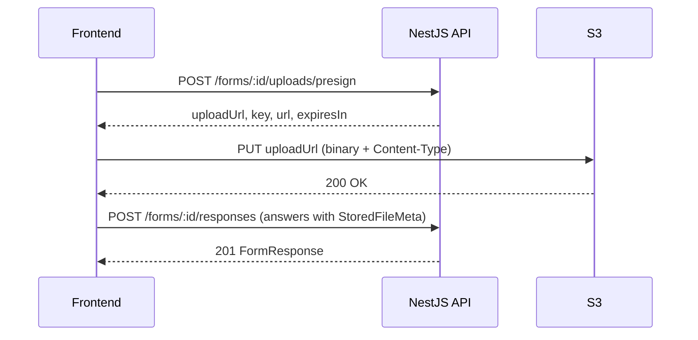
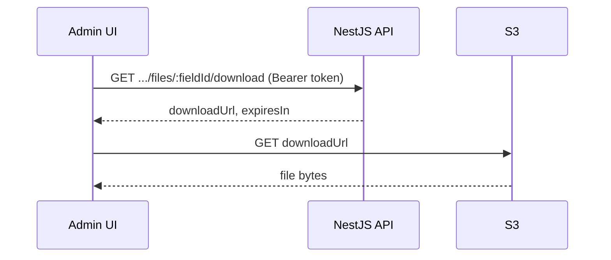

# Form Builder — Frontend API Reference

Practical API guide for React (or similar) frontends integrating the **Referral-system** form builder and public form renderer.

> For admin/agent management endpoints (user CRUD, agents, password reset), see [api-reference.md](./api-reference.md).

---

## Quick start

| Item | Value |
|------|-------|
| Base URL (local) | `http://localhost:3000` |
| Frontend env var | `VITE_API_URL` (or your bundler equivalent) |
| API prefix | **None** — routes are `/forms`, `/admins`, `/agents` |
| Swagger UI | `GET /docs` |
| Content-Type | `application/json` on all JSON bodies |
| CORS | Enabled for all origins (`*`) |

```ts
const API_BASE = import.meta.env.VITE_API_URL ?? 'http://localhost:3000';
```

---

## Authentication (admin JWT)

The form **admin UI** (create/list/update forms, view submissions, download files) uses an **admin JWT** obtained from login.

### Obtain a token

```http
POST /admins/login
Content-Type: application/json

{
  "email": "admin@example.com",
  "password": "password1"
}
```

**Success `200`:**

```json
{
  "accessToken": "eyJhbGciOiJIUzI1NiIs...",
  "admin": {
    "id": "uuid",
    "name": "Jane Admin",
    "email": "admin@example.com",
    "role": "admin",
    "isActive": true,
    "lastLogin": "2026-06-16T10:00:00.000Z",
    "createdAt": "2026-06-16T09:00:00.000Z",
    "updatedAt": "2026-06-16T10:00:00.000Z"
  }
}
```

**Rate limit:** 5 requests / minute.

Store `accessToken` (e.g. `localStorage`, `sessionStorage`) and send it on protected requests:

```http
Authorization: Bearer <accessToken>
```

### JWT payload (for UI hints only)

```json
{
  "id": "uuid",
  "role": "admin | superAdmin",
  "tokenVersion": 0
}
```

Decode client-side only for **UI** (show/hide menus). The API enforces roles server-side.

### Access levels used by forms

| Level | Requirement | Form endpoints |
|-------|-------------|----------------|
| **Public** | No token | `GET /forms/:id`, `POST /forms/:id/responses`, `POST /forms/:id/uploads/presign` |
| **Admin** | Valid admin JWT (`role`: `admin` or `superAdmin`) | Update/delete form, list/delete responses, download files |
| **Super Admin** | Admin JWT + `role: "superAdmin"` | Create form, list all forms |

### Token invalidation

Tokens stop working after logout, password change/reset, or account deactivation. The API returns `401` with a localized message (e.g. `"Invalid or expired token"`). Clear stored tokens and redirect to login.

### cURL — login

```bash
curl -s -X POST "$VITE_API_URL/admins/login" \
  -H "Content-Type: application/json" \
  -d '{"email":"admin@example.com","password":"password1"}'
```

---

## Internationalization

Send `Accept-Language` on every request. Supported: `en` (default), `hi`, `gu`.

```ts
headers: {
  'Content-Type': 'application/json',
  'Accept-Language': userLocale, // 'en' | 'hi' | 'gu'
  ...(token ? { Authorization: `Bearer ${token}` } : {}),
}
```

**Important:** Error responses contain **localized human-readable text**, not i18n keys. See [Error keys reference](#error-keys-reference) below if you maintain your own message map.

---

## TypeScript types

Copy or adapt these in your frontend. Backend field names are the source of truth.

```ts
/** Backend `Form.id` — use as `formId` in your FormSchema */
type FormId = string;

type FieldType =
  | 'text'
  | 'textarea'
  | 'dropdown'
  | 'multi_dropdown'
  | 'radio'
  | 'multi_radio'
  | 'checkbox'
  | 'checkbox_group'
  | 'file';

interface FieldValidation {
  required?: boolean;
  minLength?: number;
  maxLength?: number;
  pattern?: string;
  allowedFileTypes?: string[];  // MIME types or extensions, e.g. "application/pdf" or ".pdf"
  maxFileSizeMB?: number;       // default enforced server-side: 10 MB
  errorMessage?: string;        // client-side display hint only; server uses its own messages
}

interface FormField {
  id: string;
  type: FieldType;
  label: string;
  placeholder?: string;
  options?: string[];           // required for dropdown, multi_dropdown, radio, multi_radio, checkbox_group
  validation?: FieldValidation;
}

/** Full form as returned by GET /forms/:id */
interface Form {
  id: FormId;
  title: string;
  description: string | null;
  fields: FormField[];
  isPublished: boolean;
  createdById: string;
  createdAt: string;            // ISO 8601
  updatedAt: string;
}

/** Summary row from GET /forms (no fields array) */
interface FormSummary {
  id: FormId;
  title: string;
  description: string | null;
  isPublished: boolean;
  createdAt: string;
  updatedAt: string;
}

/** Map backend form → your FormSchema */
interface FormSchema {
  formId: FormId;               // = Form.id
  title: string;
  description?: string;
  fields: FormField[];
}

function toFormSchema(form: Form): FormSchema {
  return {
    formId: form.id,
    title: form.title,
    description: form.description ?? undefined,
    fields: form.fields,
  };
}

interface StoredFileMeta {
  kind: 'file';
  key: string;
  url: string;
  name: string;
  size: number;
  type: string;                 // MIME type
}

type StoredAnswerValue =
  | string
  | string[]
  | boolean
  | StoredFileMeta
  | null;

interface FormResponse {
  id: string;
  formId: FormId;
  answers: Record<string, StoredAnswerValue>;
  submittedAt: string;
}
```

### Answer value by field type

| Field type | `StoredAnswerValue` shape |
|------------|---------------------------|
| `text`, `textarea` | `string` |
| `dropdown`, `radio` | `string` |
| `multi_dropdown`, `multi_radio`, `checkbox_group` | `string[]` |
| `checkbox` | `boolean` |
| `file` | `StoredFileMeta` (after S3 upload) |
| Optional / empty | `null` or omit key (required fields must be present) |

---

## Forms endpoints

Base path: `/forms`

### Overview

| Method | Path | Auth | Rate limit |
|--------|------|------|------------|
| `POST` | `/forms` | Super Admin | 60/min (global) |
| `GET` | `/forms` | Super Admin | 60/min |
| `GET` | `/forms/:id` | Public | 60/min |
| `PUT` | `/forms/:id` | Admin | 60/min |
| `DELETE` | `/forms/:id` | Admin | 60/min |
| `POST` | `/forms/:id/responses` | Public | **10/min** |
| `GET` | `/forms/:id/responses` | Admin | 60/min |
| `DELETE` | `/forms/:id/responses/:responseId` | Admin | 60/min |
| `POST` | `/forms/:id/uploads/presign` | Public | **20/min** |
| `GET` | `/forms/:id/responses/:responseId/files/:fieldId/download` | Admin | 60/min |

Global default: **60 requests / minute** per IP. Exceeded → `429 Too Many Requests`.

---

### `POST /forms` — Create form

**Auth:** Super Admin

**Body:**

```json
{
  "title": "Contact Us",
  "description": "Reach out to our team",
  "fields": [
    {
      "id": "full_name",
      "type": "text",
      "label": "Full Name",
      "placeholder": "Jane Doe",
      "validation": { "required": true, "minLength": 2, "maxLength": 100 }
    },
    {
      "id": "department",
      "type": "dropdown",
      "label": "Department",
      "options": ["Sales", "Support"],
      "validation": { "required": true }
    },
    {
      "id": "resume",
      "type": "file",
      "label": "Resume",
      "validation": {
        "required": true,
        "allowedFileTypes": ["application/pdf", ".pdf"],
        "maxFileSizeMB": 5
      }
    }
  ],
  "isPublished": true
}
```

| Field | Type | Required | Rules |
|-------|------|----------|-------|
| `title` | `string` | Yes | 1–255 chars |
| `description` | `string` | No | Max 2000 chars |
| `fields` | `FormField[]` | No | Default `[]` |
| `isPublished` | `boolean` | No | Default `true` |

**Success `201`:** Full `Form` object. Save `id` as your `formId`.

**Errors:**

| Status | i18n key | English message |
|--------|----------|-----------------|
| `400` | `form.duplicateFieldId` | Duplicate field ID in schema |
| `400` | `form.optionsRequired` | This field type requires at least one option |
| `400` | `validation.*` | Zod validation (see keys table) |
| `401` | `auth.*` | Missing/invalid token |
| `403` | `auth.notAuthorized` | Not super admin |

**cURL:**

```bash
curl -s -X POST "$VITE_API_URL/forms" \
  -H "Content-Type: application/json" \
  -H "Authorization: Bearer $TOKEN" \
  -d '{"title":"Contact Us","fields":[{"id":"name","type":"text","label":"Name"}]}'
```

---

### `GET /forms` — List forms

**Auth:** Super Admin

Returns summaries only (no `fields`).

**Success `200`:**

```json
[
  {
    "id": "550e8400-e29b-41d4-a716-446655440000",
    "title": "Contact Us",
    "description": "Reach out to our team",
    "isPublished": true,
    "createdAt": "2026-06-16T10:00:00.000Z",
    "updatedAt": "2026-06-16T10:00:00.000Z"
  }
]
```

Ordered by `updatedAt` descending.

---

### `GET /forms/:id` — Get form schema (public render)

**Auth:** Public

Used by the public form page to load schema at runtime. Works for unpublished forms too (check `isPublished` before allowing submit).

**Success `200`:** Full `Form` object.

**Errors:**

| Status | i18n key | English message |
|--------|----------|-----------------|
| `404` | `form.notFound` | Form not found |

**cURL:**

```bash
curl -s "$VITE_API_URL/forms/550e8400-e29b-41d4-a716-446655440000"
```

---

### `PUT /forms/:id` — Update form schema

**Auth:** Admin (any active admin)

At least one property required in body.

**Body:**

```json
{
  "title": "Contact Us (updated)",
  "description": "Updated copy",
  "fields": [],
  "isPublished": false
}
```

**Success `200`:** Updated `Form`.

**Errors:** Same validation errors as create (`duplicateFieldId`, `optionsRequired`, Zod).

---

### `DELETE /forms/:id` — Soft-delete form

**Auth:** Admin

Soft-deletes the form **and all its responses**. S3 files from responses are deleted in the background.

**Success `200`:**

```json
{
  "message": "Form deleted successfully"
}
```

After deletion, `GET /forms/:id` returns `404`. The record remains in the DB with `deletedAt` set but is excluded from all API queries.

---

### `POST /forms/:id/responses` — Submit response

**Auth:** Public  
**Rate limit:** 10 / minute

**Body:**

```json
{
  "answers": {
    "full_name": "Jane Doe",
    "department": "Sales",
    "agree_terms": true,
    "skills": ["JavaScript", "TypeScript"],
    "resume": {
      "kind": "file",
      "key": "forms/550e8400-e29b-41d4-a716-446655440000/resume/a1b2c3d4_resume.pdf",
      "url": "https://your-bucket.s3.ap-south-1.amazonaws.com/forms/.../resume.pdf",
      "name": "resume.pdf",
      "size": 204800,
      "type": "application/pdf"
    }
  }
}
```

Keys in `answers` must match field `id` values from the form schema.

**Success `201`:**

```json
{
  "id": "resp-uuid",
  "formId": "550e8400-e29b-41d4-a716-446655440000",
  "answers": { "...": "..." },
  "submittedAt": "2026-06-16T10:05:00.000Z"
}
```

**Errors:**

| Status | i18n key | English message |
|--------|----------|-----------------|
| `400` | `form.notPublished` | This form is not accepting responses |
| `400` | `form.requiredFieldMissing` | A required field is missing |
| `400` | `form.invalidFileKey` | Invalid file reference |
| `404` | `form.notFound` | Form not found |
| `429` | — | Too many requests |

**cURL:**

```bash
curl -s -X POST "$VITE_API_URL/forms/$FORM_ID/responses" \
  -H "Content-Type: application/json" \
  -d '{"answers":{"full_name":"Jane Doe"}}'
```

---

### `GET /forms/:id/responses` — List submissions

**Auth:** Admin

**Success `200`:** `FormResponse[]`, newest first. Soft-deleted responses are excluded.

---

### `DELETE /forms/:id/responses/:responseId` — Soft-delete submission

**Auth:** Admin

**Success `200`:**

```json
{
  "message": "Response deleted successfully"
}
```

S3 files for that response are deleted in the background.

**Errors:**

| Status | i18n key | English message |
|--------|----------|-----------------|
| `404` | `form.responseNotFound` | Response not found |

---

## File upload flow

Files are **not** uploaded through the API body. Use presigned S3 URLs: presign → PUT to S3 → include metadata in submit.



### Step 1 — Request presigned upload URL

```http
POST /forms/:id/uploads/presign
Content-Type: application/json

{
  "fieldId": "resume",
  "fileName": "resume.pdf",
  "contentType": "application/pdf",
  "size": 204800
}
```

| Field | Type | Required |
|-------|------|----------|
| `fieldId` | `string` | Yes — must match a `file` field `id` on the form |
| `fileName` | `string` | Yes — max 255 chars |
| `contentType` | `string` | Yes — MIME type |
| `size` | `number` | Yes — file size in **bytes** (positive integer) |

**Success `201`:**

```json
{
  "uploadUrl": "https://your-bucket.s3.ap-south-1.amazonaws.com/forms/...?X-Amz-Algorithm=...",
  "key": "forms/form-uuid/resume/f8e9d0c1_resume.pdf",
  "url": "https://your-bucket.s3.ap-south-1.amazonaws.com/forms/form-uuid/resume/f8e9d0c1_resume.pdf",
  "expiresIn": 300
}
```

- `uploadUrl` expires in **300 seconds** (5 minutes).
- `key` follows pattern: `forms/{formId}/{fieldId}/{uploadId}_{sanitizedFileName}`.
- `url` is the stable object URL to store in answers (not directly downloadable without presign for private buckets).

**Errors:**

| Status | i18n key | English message |
|--------|----------|-----------------|
| `400` | `form.notPublished` | This form is not accepting responses |
| `400` | `form.fileFieldNotFound` | File field not found on this form |
| `400` | `form.fileTooLarge` | File exceeds the maximum allowed size |
| `400` | `form.fileTypeNotAllowed` | File type is not allowed |

### Step 2 — Upload file to S3

```http
PUT <uploadUrl>
Content-Type: application/pdf

<binary file bytes>
```

Use `fetch` without JSON headers:

```ts
await fetch(uploadUrl, {
  method: 'PUT',
  headers: { 'Content-Type': file.type },
  body: file,
});
```

Do **not** send the admin JWT to S3. Only `Content-Type` must match what you sent to presign.

### Step 3 — Submit form with file metadata

Build `StoredFileMeta` from the presign response + original file info:

```ts
const fileAnswer: StoredFileMeta = {
  kind: 'file',
  key: presign.key,
  url: presign.url,
  name: file.name,
  size: file.size,
  type: file.type,
};

await submitResponse(formId, {
  answers: { [fieldId]: fileAnswer, /* other fields */ },
});
```

The server verifies that `key` starts with `forms/{formId}/{fieldId}/`.

### cURL — full upload sequence

```bash
# 1. Presign
PRESIGN=$(curl -s -X POST "$VITE_API_URL/forms/$FORM_ID/uploads/presign" \
  -H "Content-Type: application/json" \
  -d '{"fieldId":"resume","fileName":"resume.pdf","contentType":"application/pdf","size":204800}')

UPLOAD_URL=$(echo "$PRESIGN" | jq -r '.uploadUrl')

# 2. Upload to S3
curl -s -X PUT "$UPLOAD_URL" \
  -H "Content-Type: application/pdf" \
  --data-binary @resume.pdf

# 3. Submit (use key/url from presign response)
curl -s -X POST "$VITE_API_URL/forms/$FORM_ID/responses" \
  -H "Content-Type: application/json" \
  -d "{\"answers\":{\"resume\":$(echo "$PRESIGN" | jq '{kind:"file", key:.key, url:.url, name:"resume.pdf", size:204800, type:"application/pdf"}')}}"
```

---

## File download flow (admin)

Submissions store file **metadata** only. Admins fetch a short-lived download URL.



### Request download URL

```http
GET /forms/:id/responses/:responseId/files/:fieldId/download
Authorization: Bearer <accessToken>
```

| Param | Description |
|-------|-------------|
| `id` | Form UUID |
| `responseId` | Submission UUID |
| `fieldId` | File field `id` from schema |

**Success `200`:**

```json
{
  "downloadUrl": "https://your-bucket.s3...?X-Amz-Signature=...",
  "expiresIn": 3600
}
```

Open in a new tab, or `fetch` + blob download:

```ts
const { downloadUrl } = await api(`/forms/${formId}/responses/${responseId}/files/${fieldId}/download`, {
  token: adminToken,
});
window.open(downloadUrl, '_blank');
```

**Errors:**

| Status | i18n key | English message |
|--------|----------|-----------------|
| `404` | `form.fileNotFound` | Uploaded file not found |
| `404` | `form.responseNotFound` | Response not found |

**cURL:**

```bash
curl -s "$VITE_API_URL/forms/$FORM_ID/responses/$RESPONSE_ID/files/resume/download" \
  -H "Authorization: Bearer $TOKEN"
```

---

## Soft delete behavior

| Resource | Endpoint | What happens |
|----------|----------|--------------|
| Form | `DELETE /forms/:id` | Sets `deletedAt` on form and all responses; deletes S3 files async |
| Response | `DELETE /forms/:id/responses/:responseId` | Sets `deletedAt` on response; deletes its S3 files async |

Soft-deleted records:

- Do not appear in `GET /forms`, `GET /forms/:id`, or `GET /forms/:id/responses`
- Return `404` if accessed by ID
- Are retained in the database for audit/recovery (not exposed via API)

---

## Error response shape

All errors:

```json
{
  "statusCode": 400,
  "message": "Human-readable message or array of validation messages",
  "error": "Bad Request"
}
```

| Field | Notes |
|-------|-------|
| `statusCode` | HTTP status |
| `message` | Localized string or array (Zod validation) |
| `error` | Localized HTTP label; omitted for `401` and `500` |

### Common status codes (forms)

| Code | When |
|------|------|
| `400` | Validation, unpublished form, missing required field, bad file key/type/size |
| `401` | Missing/invalid/expired JWT |
| `403` | Valid JWT but wrong role (e.g. non–super-admin on `POST /forms`) |
| `404` | Form, response, or file not found (or soft-deleted) |
| `429` | Rate limit exceeded |
| `500` | Server error |

---

## Error keys reference

The backend throws **i18n keys** internally; the API **translates** them using `Accept-Language` before responding. The `message` field in JSON is localized text, not the key.

Use this table if you want stable identifiers in frontend error maps (match on key in your own layer, or compare English defaults when locale is `en`).

### Form domain (`form.*`)

| Key | English (`en`) |
|-----|----------------|
| `form.notFound` | Form not found |
| `form.notPublished` | This form is not accepting responses |
| `form.deleted` | Form deleted successfully |
| `form.responseNotFound` | Response not found |
| `form.responseDeleted` | Response deleted successfully |
| `form.duplicateFieldId` | Duplicate field ID in schema |
| `form.optionsRequired` | This field type requires at least one option |
| `form.requiredFieldMissing` | A required field is missing |
| `form.fileFieldNotFound` | File field not found on this form |
| `form.fileTooLarge` | File exceeds the maximum allowed size |
| `form.fileTypeNotAllowed` | File type is not allowed |
| `form.fileNotFound` | Uploaded file not found |
| `form.invalidFileKey` | Invalid file reference |

### Validation (`validation.*`) — request body / Zod

| Key | English (`en`) |
|-----|----------------|
| `validation.title.required` | Title is required |
| `validation.fieldId.required` | Field ID is required |
| `validation.label.required` | Label is required |
| `validation.atLeastOneField` | At least one field must be provided |
| `validation.fileName.required` | File name is required |
| `validation.contentType.required` | Content type is required |
| `validation.fileSize.required` | File size is required |
| `validation.fileKey.required` | File key is required |
| `validation.fileUrl.invalid` | File URL is invalid |

Zod errors may prefix the field path: `"title: Title is required"`.

### Auth (`auth.*`) — protected form routes

| Key | English (`en`) |
|-----|----------------|
| `auth.missingAuthHeader` | Missing authorization header |
| `auth.invalidAuthFormat` | Invalid authorization format. Use Bearer \<token\> |
| `auth.invalidOrExpiredToken` | Invalid or expired token |
| `auth.notAuthorized` | You are not authorized to perform this action |

---

## Suggested API client

```ts
const API_BASE = import.meta.env.VITE_API_URL ?? 'http://localhost:3000';

type ApiError = {
  status: number;
  statusCode: number;
  message: string | string[];
  error?: string;
};

async function api<T>(
  path: string,
  options: RequestInit & { token?: string; locale?: string } = {},
): Promise<T> {
  const { token, locale = 'en', headers, ...rest } = options;

  const res = await fetch(`${API_BASE}${path}`, {
    ...rest,
    headers: {
      'Content-Type': 'application/json',
      'Accept-Language': locale,
      ...(token ? { Authorization: `Bearer ${token}` } : {}),
      ...headers,
    },
  });

  const data = await res.json().catch(() => ({}));

  if (!res.ok) {
    throw { status: res.status, ...data } satisfies ApiError;
  }

  return data as T;
}

// Public: load form for rendering
export const getFormSchema = (formId: string) =>
  api<Form>(`/forms/${formId}`).then(toFormSchema);

// Admin: list submissions
export const listResponses = (formId: string, token: string) =>
  api<FormResponse[]>(`/forms/${formId}/responses`, { token });
```

### Frontend checklist

- [ ] Set `VITE_API_URL` per environment
- [ ] Send `Accept-Language` on all requests
- [ ] Super-admin UI: create + list forms (`POST /forms`, `GET /forms`)
- [ ] Admin UI: edit, delete, view responses, download files
- [ ] Public form: `GET /forms/:id` → render → presign/upload → `POST .../responses`
- [ ] Block submit when `isPublished === false`
- [ ] Handle `401` globally (clear token, redirect to admin login)
- [ ] Handle `429` with retry/backoff on submit and presign
- [ ] For file fields: never POST multipart to the API; always use presign flow

---

## Related docs

- [api-reference.md](./api-reference.md) — full API including `/admins` and `/agents`
- [project_structure.md](./project_structure.md) — backend codebase layout
